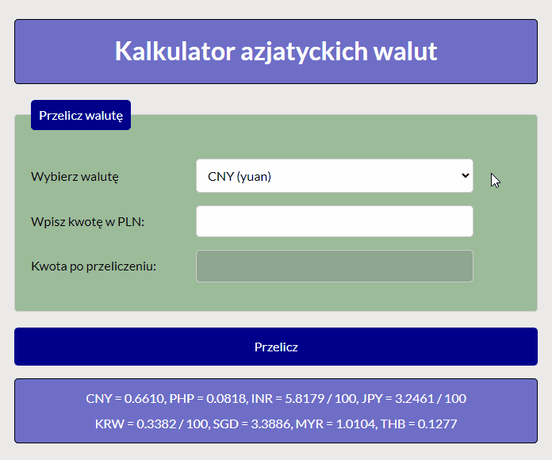

# Asian currency converter

made by Błażej Gródecki - DEMO: https://blazej-grodecki.github.io/Currency-converter/

## About.
Simple Asian currency converter.

In my currency converter you can convert PLN to:
- CCNY (yuan)
- PHP (peso)
- INR (rupia)
- JPY (jen)
- KRW (won)
- SGD (dolar)
- MYR (ringgit)
- THB (baht)

## How it works:

## Technologies used:
- HTML
- CSS
- JavaScript
- BEM Convention
- Normalise.css
